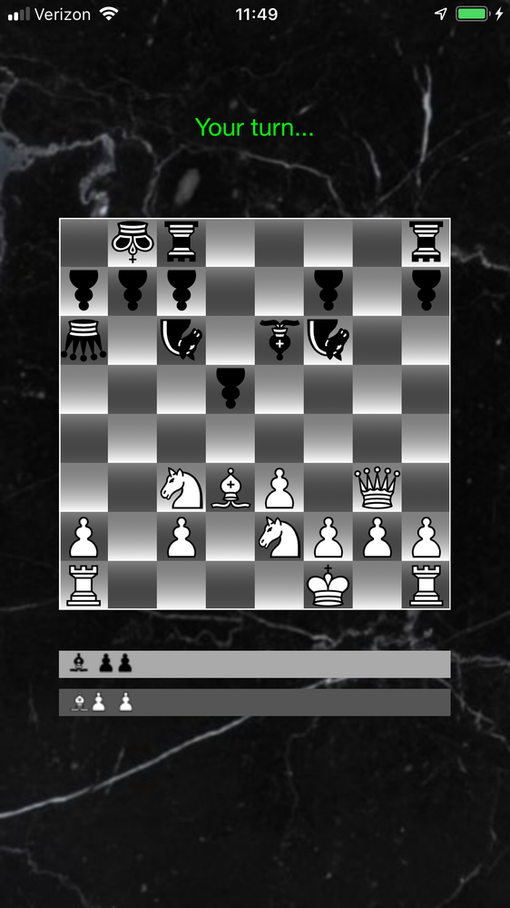

# Chessboard

Chessboard is an app that lets a device act as a chessboard and play a game against another device running the app. It is not a chess game. It lets two people play a game against each other. It does make sure that moves are valid (for the most part. a few special moves are either not implemented, or not fully implemented).

When two players run the app on their devices the app uses MultipeerConnectivity to find another local device and start the game.

|

## System Requirements

* Deployment target iOS 10+
* Xcode 10.0+
* Swift 4.0+

## License

Chessboard is licensed under the Unlicense. See the LICENSE file for more information, but basically this is sample code and you can do whatever you want with it.
